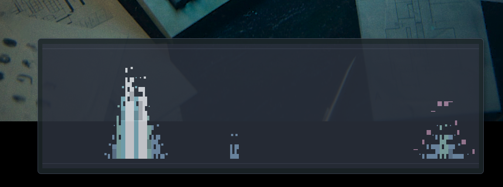

# Input Spectrum TUI

`inputspectrum` turns keyboard input into a live spectrum wall. Each key press injects a drifting wave packet into the bands; faster typing produces taller, denser pulses.



The global keyboard listener follows the same broad route as Screenkey: it first tries the X11 Record extension, then falls back to Linux `/dev/input/event*` keyboard events if RECORD is unavailable or rejected. The evdev fallback usually requires running as a user in the `input` group or using `sudo`.

## Run

From this repository:

```bash
cargo run --locked -- --fps 60 --bars 120 --theme nord
```

Build a local binary:

```bash
cargo build --release --locked
./target/release/inputspectrum --fps 60 --bars 120 --theme nord
```

Debug a startup hang:

```bash
INPUTSPECTRUM_DEBUG_LOG=/tmp/inputspectrum.log cargo run --locked -- --fps 60
INPUTSPECTRUM_BACKEND=evdev cargo run --locked -- --fps 60
INPUTSPECTRUM_BACKEND=none cargo run --locked -- --fps 60
```

`INPUTSPECTRUM_BACKEND` accepts `auto`, `x11`, `evdev`, or `none`. Unknown backend values fall back to `auto` and are recorded in `INPUTSPECTRUM_DEBUG_LOG` when debug logging is enabled. Use `none` when you only want terminal-local controls and no global keyboard capture.

## Options

```text
--fps 10..120              render frame rate
--bars 8..240              internal spectrum band count
--theme nord|mono|amber    color theme; no legacy aliases
--mode bars|wave|peaks     initial render mode
```

## Controls

- `q` / `Esc`: quit
- `space`: pause or resume decay/render updates
- `tab`: switch mode (`bars`, `wave`, `peaks`)
- `1`, `2`, `3`: switch theme (`nord`, `mono`, `amber`)
- `+` / `-`: adjust sensitivity

Control keys only change settings; they do not inject spectrum energy.

## Modes

- `bars`: solid vertical spectrum bars with a short peak cap
- `wave`: a continuous contour trace driven by the current energy field
- `peaks`: sparse peak-hold markers with minimal floor traces

## Scope

The visual surface is intentionally clean: no title, status bar, or on-screen control hints. Mouse events are ignored. Terminal-local controls still work when the TUI is focused so the process can be closed safely.
